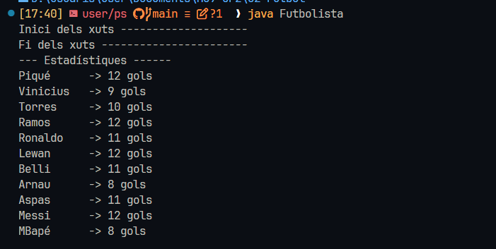
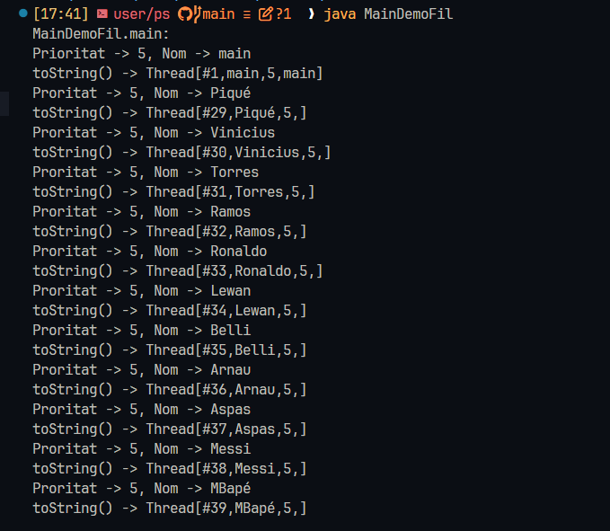

# 02-Futbol

En esta actividad he usado hilos para ejecutar procesos en "paralelo",
y luego accediendo a sus datos cuando ya han sido procesados.
 

## Primera parte

Este es el resultado de la ejecución de todos los procesos de los futbolistas:

## Segunda parte

Este es el resultado de llamar los hilos de futbolistas desde otra clase accediendo a sus pripiedades como,
prioridad, nombre, etc.

