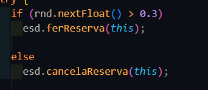
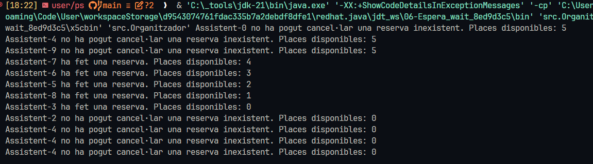
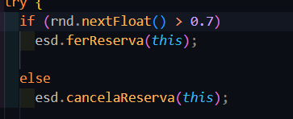
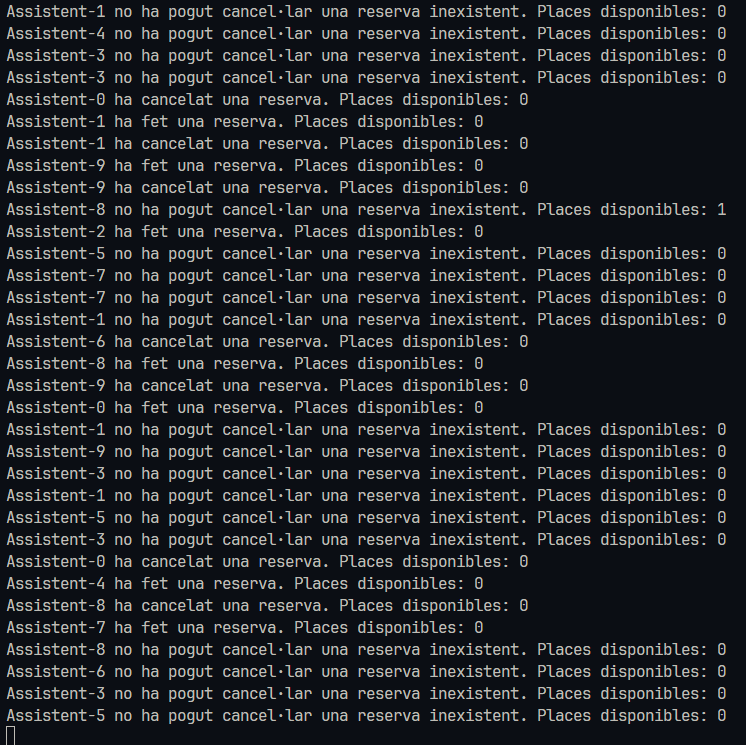

# 06-Espera_wait

## Preguntas

 - **Por qué se para la ejecución despues de un tiempo?**

 R: El metodo de hacer reserva  al ser sincronizado, en caso que algun asistente, no pueda hacer la reserva
 por plazas insuficientes, quedará esperando a que alguien haga deshaga su reserva. 

 Llega un punto en el que cuando ya no quedan mas reservas, todos por probabilidad terminan intentando reservar de nuevo,
 incluso los que ya tenian una reservas antes, y todos los asistentes quedan esperando primeramente al wait,
 y segundo a que se libere el método por la sincronización.

 - **Que pasaría si en lugar de una probabilidad de 50%-50% fuera de 70%(ferReserva)-30%(cancelar)? Y si fueran al revés? las probabilidades? --> Muestra la porción de código modificada y la salida resultante en cada uno de los 2 casos**

 R: 70% reservar, 30% cancelar:  
 En este caso pasa que hay más probabilidades de que los que ya tengan una reserva, vuelvan a intentar a hacer más reservas
 y llegando a bloquearlas todas más rapidamente

 
 
  

 R: 30% reservar, 70% cancelar:  
 En este caso pasa que al contrario, no intentarán hacer reservas y en cambio, la lista de reservas tiene más probabilidades de estar disponible, al no bloquearse facilmente por todos intentar reservar incluso los que ya tenian reserva

 
 

 - **Por qué crees que hace falta la lista y no solo una variable entera de reservas?**

 R: Supongo que es por la necesidad de saber si un asistente ha reservado o no para entonces el mismo cancelar su reserva.
 
 